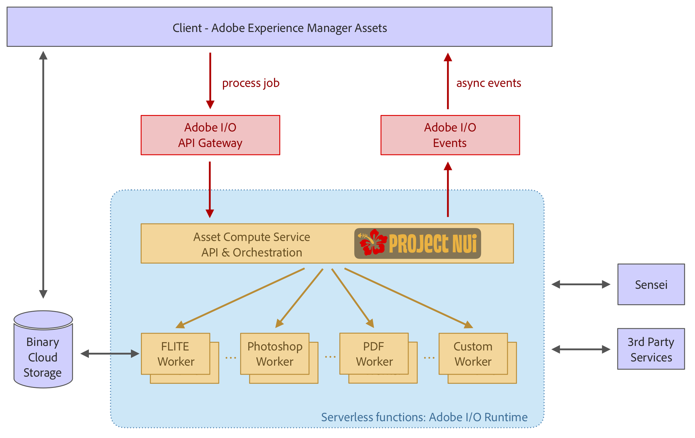

# Architecture of [!DNL Asset Compute Service] {#overview}

The [!DNL Asset Compute Service] is built on top of serverless [!DNL Adobe I/O] Runtime platform. It provides Adobe Sensei content services support for assets. The invoking client (only [!DNL Experience Manager] as a [!DNL Cloud Service] is supported) is provided with the Adobe Sensei-generated information that it sought for the asset. The information returned is in JSON format.

[!DNL Asset Compute Service] is extendable by creating custom applications based on [!DNL Project Adobe Developer App Builder]. These custom applications are [!DNL Project Adobe Developer App Builder] headless apps and do tasks such as add custom conversion tools or call external APIs to perform image operations.

[!DNL Project Adobe Developer App Builder] is a framework to build and deploy custom web applications on [!DNL Adobe I/O] runtime. To create custom applications, the developers can leverage [!DNL React Spectrum] (Adobe’s UI toolkit), create microservices, create custom events, and orchestrate APIs. See [documentation of Adobe Developer App Builder](https://developer.adobe.com/app-builder/docs/overview).

The foundation on which the architecture is based includes:

* The modularity of applications – only containing what is needed for a given task – allows to decouple applications from each other and keep them lightweight.

* The serverless concept of [!DNL Adobe I/O] Runtime yields numerous benefits: asynchronous, highly scalable, isolated, job-based processing, which is a perfect fit for asset processing.

* Binary cloud storage provides the necessary features for storing and accessing asset files and renditions individually, without requiring full access permissions to the storage, using pre-signed URL references. Transfer acceleration, CDN caching, and co-locating compute applications with cloud storage allow for optimal low latency content access. Both AWS and Azure clouds are supported.

*Figure: Architecture of [!DNL Asset Compute Service] and how it integrates with [!DNL Experience Manager], storage, and processing application.*

The architecture consists of the following parts:

* **An API and orchestration layer** receives requests (in JSON format) which instruct the service to transform a source asset into multiple renditions. The requests are asynchronous and return with an activation ID, that is job ID. Instructions are purely declarative, and for all standard processing work (e.g. thumbnail generation, text extraction) consumers only specify the desired result, but not the applications that handle certain renditions. Generic API features such as authentication, analytics, rate limiting, are handled using the Adobe API Gateway in front of the service and manages all requests going to [!DNL Adobe I/O] Runtime. The application routing is done dynamically by the orchestration layer. Custom application can be specified by clients for specific renditions and include custom parameters. Application execution can be fully parallelized as they are separate serverless functions in [!DNL Adobe I/O] Runtime.

* **Applications to process assets** that specialize on certain types of file formats or target renditions. Conceptually, an application is like the Unix pipe concept: an input file gets transformed into one or more output files.

* **A [common application library](https://github.com/adobe/asset-compute-sdk)** handles common tasks like downloading the source file, uploading the renditions, error reporting, event sending and monitoring . This is designed so that developing an application stays as simple as possible, following the serverless idea, and can be restricted to local filesystem interactions.

<!-- TBD:

* About the YAML file?
* See [https://developer.adobe.com/app-builder/docs/getting_started/first_app/#5-anatomy-of-a-project-firefly-application](https://www.adobe.io/project-firefly/docs/getting_started/first_app/#5-anatomy-of-a-project-firefly-application).

* minimize description to custom applications
* remove all internal stuff (e.g. Photoshop application, API Gateway) from text and diagram
* update diagram to focus on 3rd party custom applications ONLY
* Explain important transactions/handshakes?
* Flow of assets/control? See the illustration on the Nui diagrams wiki.
* Illustrations. See the SVG shared by Alex.
* Exceptions? Limitations? Call-outs? Gotchas?
* Do we want to add what basic processing is not available currently, that is expected by existing AEM customers?
-->
